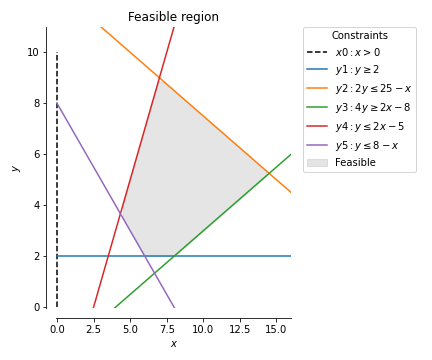

# Feasible_Region: A linear programming tool (beta)
A functional implementation for producing the feasible region plot given a dictionary of constraints.

## Function:
* `feasible.fr_plotting.plot_feasible_region_2D`

## Workflow:
* Prep input dict(s)
* Call function
* Optional: save fig
* Show

## Example:

```
from feasible import fr_plotting as frplt

x = np.linspace(0, 20) #50 pts
constraints = dict(
                   x_0=(x*0, r'$x0: x>0$'),
                   #y_0=(x*0, r'$y0: y>0$'),
                   y_1=(x*0 + 2, r'$y1: y\geq2$'),
                   y_2=((25-x)/2.0, r'$y2: 2y\leq25-x$'),
                   y_3=((2*x-8)/4.0, r'$y3: 4y\geq 2x - 8$'),
                   y_4=(2*x -5, r'$y4: y\leq 2x-5$'),
                   y_5=(8 -x, r'$y5: y\leq 8-x$'),
                   #y_6=(x*0 + 4, r'$y6: y\geq4$') #colinear case
                   )

ax_props = dict(xlim=(0, 16), ylim=(0, 11),
                xlabel=r'$x$', ylabel=r'$y$',
                title='Feasible region')

fig, ax = plt.subplots(figsize=(6,5))

frplt.plot_feasible_region_2D(ax, x, constraints, ax_props)

#plt.savefig(fname)
plt.show();
```
## Output:
